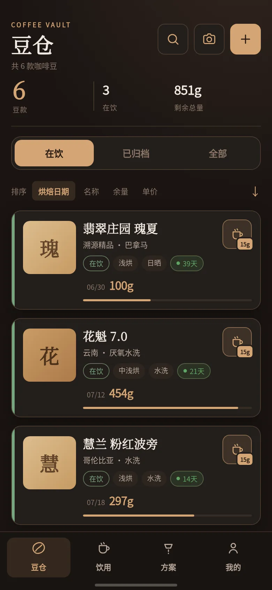
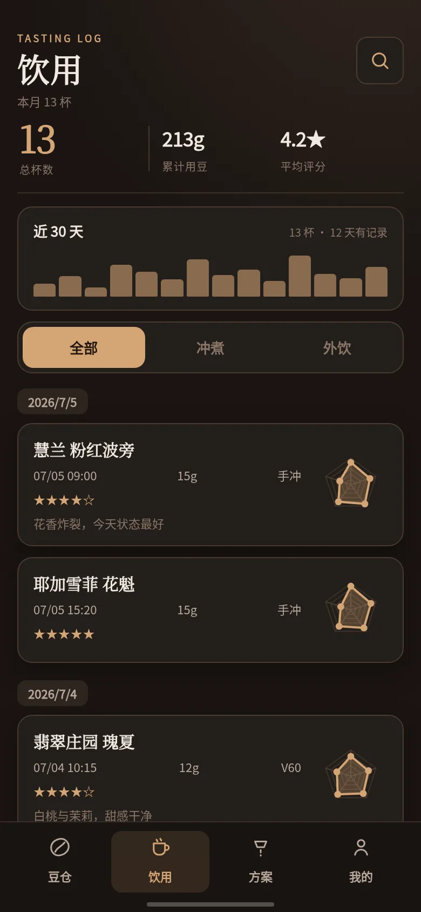
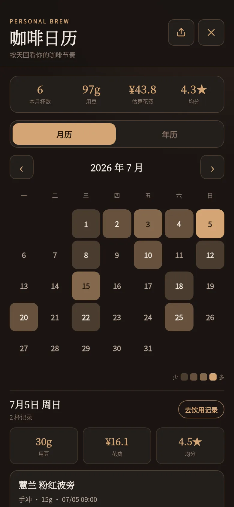
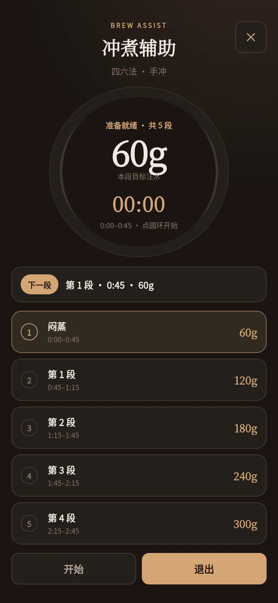
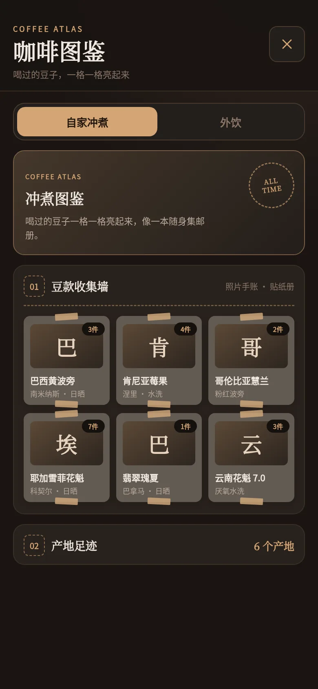
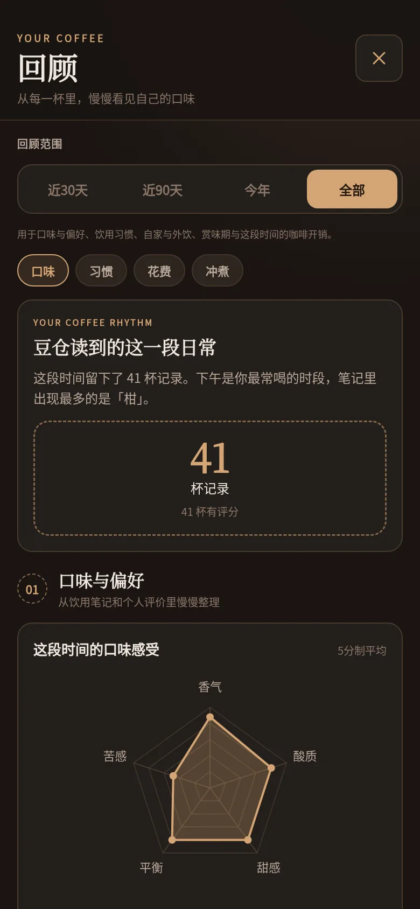

<div align="center">

  

  # 豆仓 Coffee Vault

  **一包豆子 · 一段风味 · 一页日常**

  一款本地优先（Local-First）的个人咖啡豆管理与冲煮记录 App，支持 Android 与 Web PWA。

  <p>
    <a href="https://cofevault.top/"></a>
    <a href="https://app.cofevault.top/"></a>
    <a href="https://github.com/Seeken-dai/cofeBean/releases/latest"></a>
    
    
  </p>

  <p>
    <a href="https://cofevault.top/"><b>🌐 访问官方网站</b></a>&nbsp;&nbsp;•&nbsp;&nbsp;
    <a href="https://app.cofevault.top/"><b>🚀 在线体验 Web 版</b></a>&nbsp;&nbsp;•&nbsp;&nbsp;
    <a href="https://github.com/Seeken-dai/cofeBean/releases/latest"><b>📱 下载 Android APK</b></a>&nbsp;&nbsp;•&nbsp;&nbsp;
    <a href="docs/CHANGELOG.md"><b>📖 更新日志</b></a>
  </p>

</div>

---

## 🌟 为什么选择豆仓？

- ⚡ **本地优先（Local-First）**：数据默认完整保存在设备本地私有数据库（Android SQLite / Web IndexedDB），秒级冷启动，无网环境随意记录。
- 🔒 **纯净与隐私至上**：默认**无需注册、无需登录、零广告、无第三方追踪 SDK**。拍照识别仅申请相机权限，绝不上传私密照片。
- 📷 **端侧离线 OCR 识别**：内置轻量 ML Kit 模型，离线直接解析咖啡包装上的烘焙商、产地、处理法、烘焙度、日期与风味，低可信字段醒目提醒。
- ☁️ **可选跨设备云同步**：当需要在手机与电脑等多端流转时，可一键开启云同步。基于增量游标与 LWW 冲突裁决，数据全程 HTTPS 加密，可随时一键注销并彻底清除云端数据。
- 🎨 **咖啡美学与手账质感**：提供深烘、澳白、火山灰绿、生豆等 4 款主题，搭配相纸手账滤镜、收据风分享卡片、咖啡日历与年度风味回顾。

---

## 📱 界面速览

<div align="center">
  <table>
    <tr>
      <td align="center" width="33%">
        <br />
        <sub><b>豆仓首页 · 赏味倒计时与余量管理</b></sub>
      </td>
      <td align="center" width="33%">
        <br />
        <sub><b>饮用记录 · 多维风味雷达与外饮打卡</b></sub>
      </td>
      <td align="center" width="33%">
        <br />
        <sub><b>咖啡日历 · 月历开销与连续年历格子</b></sub>
      </td>
    </tr>
    <tr>
      <td align="center" width="33%">
        <br />
        <sub><b>冲煮辅助 · 分段注水引导与计时</b></sub>
      </td>
      <td align="center" width="33%">
        <br />
        <sub><b>咖啡图鉴 · 探索足迹与里程碑</b></sub>
      </td>
      <td align="center" width="33%">
        <br />
        <sub><b>数据回顾 · 口味偏好与月报年报</b></sub>
      </td>
    </tr>
  </table>
</div>

---

## ✨ 核心功能

### 01 📦 豆仓建档与赏味管理
- **全维度档案**：记录烘焙商、产地、处理法、烘焙度、开封日期、保质期、克重、价格与购买链接。
- **开封赏味倒计时**：设定最佳赏味期天数，首页实时预警赏味将至与余量不足的豆款。
- **离线拍照识别**：端侧离线解析包装标签文字，自动提取日期、处理法等字段，支持表格式与横排标签增强。
- **智能联想与批量管理**：产地、处理法、烘焙商历史联想补全，支持批量重命名与整理。

### 02 ☕ 饮用记录与外饮打卡
- **智能扣减**：自家冲煮「喝一杯」直接扣减对应豆仓余量，首次记录自动回填开封日期。
- **外饮探索**：记录咖啡馆、饮品名、消费价格、打卡地点，不关联豆仓库存，自动合并入日历开销。
- **风味手账**：支持上传多张照片，提供多维风味评分雷达图、总评与口感笔记。

### 03 ⏱️ 冲煮方案与分段辅助计时
- **冲煮方案库**：按手冲、意式、冷萃、法压、爱乐压等方式管理参数（粉水比、研磨度、水温、器具设备）。
- **沉浸式辅助计时**：手冲时进入大字计时面板，按阶段提示注水量与时长，常驻下一段注水预览，自动记录实际耗时。
- **参数另存与复用**：满意的一杯随时一键另存为新方案，支持生成离线分享码（`DC1-`）与二维码。

### 04 📅 咖啡日历、回顾与报告
- **双重视角日历**：月历视图直观查看每日杯数、用豆与花费浮层；年度热力图串起全年的咖啡节奏。
- **深度回顾看板**：分析烘焙度偏好、常用处理法、冲煮方式占比、月度花费趋势与评分分布。
- **自然沉淀月报/年报**：自动生成阶段性咖啡月报与年度总结。

### 05 🏆 咖啡图鉴与探索足迹
- **双图鉴点亮**：冲煮图鉴与外饮图鉴分别点亮尝过的豆款、咖啡馆、产区、处理法与成就里程碑。
- **照片墙与分享**：支持豆袋相纸散开浏览与店铺照片轮播，整本图鉴可离线导出高画质长图。

### 06 🧾 票据风分享卡片
- **内容与渲染分离**：将咖啡豆档案、冲煮方案、日历日常一键生成复古票据收据风 PNG 分享图，可保存到系统相册或调用系统面板分享。

---

## 🚀 快速开始

### 体验 Web PWA 版
无需安装任何应用，在任意现代浏览器中打开即可即刻体验全部核心功能：
👉 **[https://app.cofevault.top](https://app.cofevault.top)**  
*(支持在手机浏览器中点击「添加到主屏幕」作为独立 PWA 应用离线使用)*

### 安装 Android 客户端
1. 前往 **[GitHub Releases 最新发布页](https://github.com/Seeken-dai/cofeBean/releases/latest)** 下载最新的正式安装包：
   - 文件名：`coffee-vault-3.0.4-release.apk`
   - 兼容：支持 Android 7.0 (API 24) 及以上（目标 Android 16 / API 36）
2. 手机打开 APK 并按照提示允许「安装未知应用」。
3. 后续升级只需下载新版本 APK 直接覆盖安装，本地数据库将自动无缝迁移保留。

---

## 🔒 隐私与数据安全

- **本地存储**：正式数据存放在应用私有 SQLite 数据库中，卸载前请通过设置页导出备份。
- **安全备份**：
  - 支持按需导出 JSON 备份（全部数据 / 仅豆仓与记录 / 仅冲煮方案），可勾选是否包含图片。
  - 导入支持「合并」或「覆盖」模式，采用事务安全机制，遇到解析异常自动完整回滚，绝不破坏现有数据。
- **可选云同步**：
  - 基于 Cloudflare Workers + D1 + R2 构建。
  - 数据传输全程 HTTPS 加密，采用 LWW（Last-Write-Wins）冲突裁决与墓碑机制，图片通过内容哈希寻址去重。
  - 随时可在设置中注销账号，云端数据与图片将立即全量销毁。

---

## 🛠️ 开发者指南

### 环境要求
- **Node.js**：`>= 18.0.0`
- **JDK**：`Microsoft OpenJDK 21` 或对应兼容版本
- **Android SDK**：API Level 24 ~ 36，构建工具配置 `$env:ANDROID_HOME`

### 常用命令

```powershell
# 1. 安装依赖
npm install

# 2. 运行全量自动化测试 (Node.js 内置测试套件)
npm test

# 3. 静态代码检查 (ESLint)
npm run lint

# 4. 同步 Web 前端资源至 Android 工程
npm run cap:sync

# 5. 构建 Android Debug 测试包
npm run android:debug

# 6. 构建 Android Release 正式包
npm run android:release
```

### 项目结构与文档索引

```text
cofeBean/
├── www/             # Web 与 App 前端代码（原生 HTML/CSS/JS，无额外打包器，轻量秒开）
│   ├── app.js       # 核心应用状态与交互
│   ├── data-core.js # 纯业务逻辑、筛选排序、统计与规范化（高度可测）
│   ├── repository.js# SQLite / IndexedDB 存储适配与迁移引擎
│   └── ...
├── landing/         # 官方落地页 (cofevault.top)
├── worker/          # 云同步后端 (Cloudflare Worker + D1 + R2)
├── android/         # Capacitor Android 原生壳与端侧 OCR 插件
├── tests/           # 单元测试与端到端核心逻辑测试 (node:test)
└── docs/            # 详细开发与架构文档
    ├── BUILDING.md  # 环境搭建、APK 打包、签名与哈希校验指南
    ├── CHANGELOG.md # 用户可见版本更新记录
    ├── RELEASING.md # 四大产物独立发布流程与版本约束
    └── SYNC.md      # 云同步架构设计、协议与冲突裁决说明
```

---

## 📄 开源与致谢

- 遵循本地优先原则，感谢所有为纯粹咖啡体验与开源社区贡献力量的开发者与爱好者。
- 如果在使用过程中遇到问题或有功能建议，欢迎提交 [Issues](https://github.com/Seeken-dai/cofeBean/issues)。

